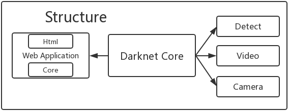
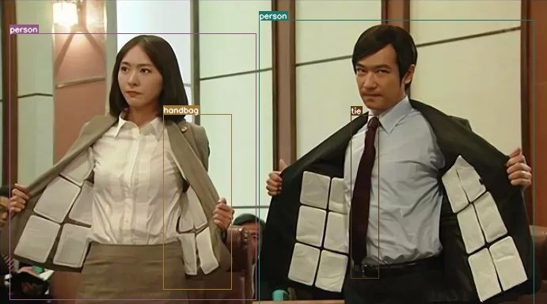

# A PyTorch implementation of a YOLO v3 Object Detector
This repository contains code for a object detector based on [YOLOv3: An Incremental Improvement](https://pjreddie.com/media/files/papers/YOLOv3.pdf), implementedin PyTorch. The code is based on the official code of [YOLO v3](https://github.com/pjreddie/darknet), as well as a PyTorch 
port of the original code, by [ayooshkathuria](https://github.com/ayooshkathuria/pytorch-yolo-v3). One of the goals of this code is to improve
upon the original port by removing redundant parts of the code (The official code is basically a fully blown deep learning 
library, and includes stuff like sequence models, which are not used in YOLO). I've also tried to keep the code minimal, and 
document it as well as I can. 


## Requirements
1. Python 3.5+
2. PyTorch 0.4+
3. [optional] OpenCV Python Package(cv2) 
4. [optional] flask
## Detection Example

## Before Using
The first thing you need to do is to download weights file and convert it to PyTorch-style weights file.
```
git clone https://github.com/WiseDoge/YOLO-v3-PyTorch.git
cd YOLO-v3-PyTorch
wget https://pjreddie.com/media/files/yolov3.weights 
python convertweight.py
```
then you will get `yolov3.pkl`.
## Running the detector
### On single or multiple images
```
python detect.py --images imgs --det det 
```
`--images` flag defines the directory to load images from, or a single image file (it will figure it out), and `--det` is the directory to save images to. Other setting such as batch size (using `--bs` flag) , object threshold confidence can be tweaked with flags that can be looked up with.
### On Video
waiting
### On Camera
waiting
### On web application(`flask` package is required)
```python app/webapp.py```  
then open your browser and visit `http://localhost:5000`.
## Reference
* https://github.com/ayooshkathuria/pytorch-yolo-v3
* https://github.com/rbgirshick/fast-rcnn